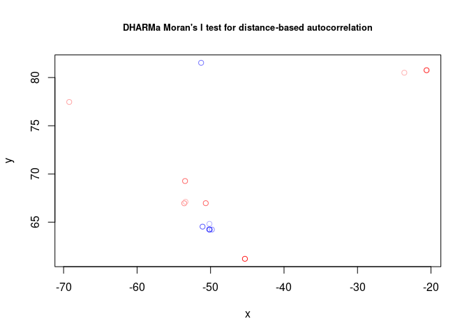
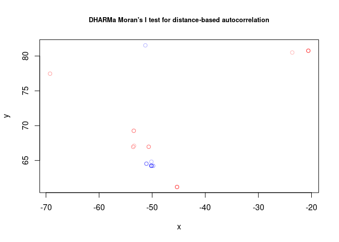

Dealing with Spatial Autocorrelation in a Gamma GLMM
================

# Problem Overview

I am working with a dataset that examines plant growth in relation to
various factors, including sea ice extent (SeaIce) at 14 different
sampling sites. To analyze the data, I am using a Gamma Generalized
Linear Mixed Model (GLMM) with a log-link function. However, I am
concerned about spatial autocorrelation in the model’s residuals and I
am unsure about the best approach to address this issue.

To solve this, I am utilizing the
[`DHARMa`](https://cran.r-project.org/web/packages/DHARMa/index.html)
package along with
[`lme4`](https://cran.r-project.org/web/packages/lme4/index.html) for
model fitting.

``` r
library(DHARMa)
library(lme4)
library(MASS)
library(gstat)
library(dplyr)
library(sf)
library(sp)
```

You can find the dataset for this model in this [GitHub
repository](https://github.com/derek-corcoran-barrios/SeaIceQuestion).

``` r
FinalDataset <- read.csv("https://raw.githubusercontent.com/derek-corcoran-barrios/SeaIceQuestion/master/FinalDataset.csv")
```

## Current Model Structure

### Response Variable

- **Growth:** Represents the annual growth increment of each individual
  plant.

### Predictors

- **SeaIce.s:** Sea ice extent per year per site, a primary predictor of
  interest (scaled).
- **age:** Age of each individual plant for each measured year, included
  as an interaction with SeaIce.s due to a biological relationship
  between plant age and growth.

### Random Effects

- **Site:** A factor representing the 14 sampling sites with varying
  distances between them. I include a random slope `(SeaIce.s | Site)`
  to account for different slopes in the growth-sea ice relationship per
  site.
- **year:** The study covers the years from 1983 to 2015 and is included
  as a random effect `(1 | year)`.
- **Individual:** A factor representing each individual plant measured.

### Model

``` r
fullmod <- glmer(Growth ~ SeaIce.s * age + (SeaIce.s | Site) + (1 | year) + (1 | Individual), data = FinalDataset, family = Gamma(link = "log"), control = glmerControl(optimizer = "bobyqa", optCtrl = list(maxfun = 2e5)))
```

# Primary Concern

My main concern is how to properly account for spatial autocorrelation
within this model. I can see that there is a problem when I use this
code in dHARMA.

``` r
res2_null <- simulateResiduals(fullmod)
res3_null <- recalculateResiduals(res2_null, group = FinalDataset$Site)
locs_null <- FinalDataset %>% group_by(Site) %>% summarise(across(c(Latitude, Longitude), mean))
testSpatialAutocorrelation(res3_null, x = locs_null$Longitude, y = locs_null$Latitude)
```

<!-- -->

    ## 
    ##  DHARMa Moran's I test for distance-based autocorrelation
    ## 
    ## data:  res3_null
    ## observed = 0.343448, expected = -0.076923, sd = 0.150983, p-value =
    ## 0.005365
    ## alternative hypothesis: Distance-based autocorrelation

As you can see by this result, there is a high spatial autocorrelation.

## Some things I have tried:

### Attempted Solution 1

One of the solutions I’ve attempted following [this
question](https://stackoverflow.com/questions/70687031/how-to-resolve-glmm-residuals-pattern-spatial-correlation-and-zero-distance-er)
to include latitude and longitude as fixed effects. However, when I test
for spatial autocorrelation using testSpatialAutocorrelation() in the
DHARMa package, I still get a significant Moran’s I with the model that
includes latitude and longitude.

``` r
LonLatmod <- glmer(Growth ~ SeaIce.s * age + Latitude + Longitude + (SeaIce.s | Site) + (1 | year) + (1 | Individual), data = FinalDataset, family = Gamma(link = "log"), control = glmerControl(optimizer = "bobyqa", optCtrl = list(maxfun = 2e5)))

res <-  simulateResiduals(LonLatmod)
res2 <- recalculateResiduals(res, group = FinalDataset$Site)
locs_latlon <- FinalDataset %>% group_by(Site) %>% summarise(across(c(Latitude, Longitude), mean))
testSpatialAutocorrelation(res2, x =  locs_latlon$Longitude, y = locs_latlon$Latitude)
```

<!-- -->

    ## 
    ##  DHARMa Moran's I test for distance-based autocorrelation
    ## 
    ## data:  res2
    ## observed = 0.382948, expected = -0.076923, sd = 0.150649, p-value =
    ## 0.002269
    ## alternative hypothesis: Distance-based autocorrelation

### Attempted Solution 2

I also tried using glmmPQL() in the MASS package. But I have not been
able to get this to work either, due to various errors, even without
adding the correlation structure. Example below:

``` r
formula_glmmPQL <- as.formula("Growth ~ SeaIce.s * age")
model_glmmPQL <- glmmPQL(formula_glmmPQL,
                         random = list(~ SeaIce.s|Site, 
                                      ~ 1|year, 
                                      ~1| Individual),
                         data = FinalDataset,
                         na.action=na.omit,
                         family = Gamma(link = "log"))

#Error in pdFactor.pdLogChol(X[[i]], ...) :
#NA/NaN/Inf in foreign function call (arg 3)
```

### Attempted Solution 3

I have also tried using variogram() in the gstat package, but I am
unsure how to interpret the shape of the variogram and what to change in
my model based on this.

``` r
FinalDatasetSF <- st_as_sf(FinalDataset, coords = c("Longitude", "Latitude"), crs = st_crs(4326))

null_mod <- variogram(log(Growth) ~ 1, FinalDatasetSF)

Abn_fit_null <- fit.variogram(null_mod, model = vgm(1, "Sph", 
                                              700, 1))
plot(null_mod, model=Abn_fit_null)
```

I have also explored the corAR1() function in the nlme package, but it
appears to be incompatible with glmer() models.

## Request for Suggestions

I would greatly appreciate any suggestions or insights on how to
effectively address spatial autocorrelation in my current modeling
approach.

## Session info
